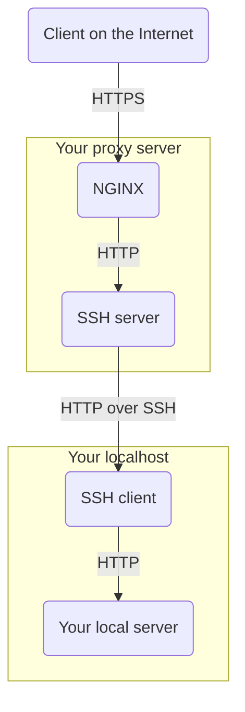

Procto
======

A script to set up a reverse proxy exposing your localhost to the internet.
It provisions a virtual machine with:

- A Let's Encrypt certificate
- Nginx to proxy from remote HTTPS to remote HTTP
- SSH to proxy from remote HTTP to local HTTP

Essentially, it's a poor man's alternative to ngrok.

Usage
-----

  * Get a Debian-based cloud virtual machine
  * Get a domain and point it to your virtual machine
  * Clone this project to your local machine
  * Add the project directory to your PATH
  * Copy `example.conf` to `~/.procto/<your.domain>.conf` and fill it
  * Use `procto-provision <your.domain>` command to provision your remote VM
  * Use `procto-connect <your.domain>` command to proxy remote HTTPS to local HTTP
  * Use `procto-disconnect <your.domain>` command to stop the proxy

If you need to set up additional ssh parameters, you can add them to your `~/.ssh/config`.
